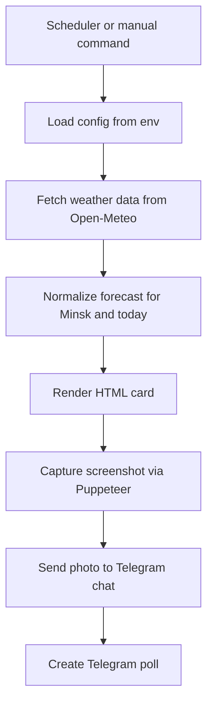

# План: Telegram-бот с карточкой погоды и опросом

## Цель
Собрать Telegram-бота на Node.js, который каждый день для Минска:
- получает прогноз погоды на сегодня и время заката
- генерирует квадратную HTML-карточку
- делает скриншот карточки через Puppeteer
- отправляет изображение в один Telegram-чат
- публикует опрос, придёт ли кто-то сегодня смотреть закат

## Предлагаемая архитектура



## Стек
- Node.js
- [`Telegraf`](https://telegraf.js.org/) для Telegram Bot API
- [`Puppeteer`](https://pptr.dev/) для скриншота HTML-карточки
- Open-Meteo API для погоды и астроданных
- `node-cron` для ежедневного запуска
- `dayjs` для форматирования времени и дат

## Структура проекта
```text
.
├── package.json
├── .env.example
├── src/
│   ├── index.js
│   ├── bot.js
│   ├── config.js
│   ├── scheduler.js
│   ├── commands/
│   │   └── today.js
│   ├── services/
│   │   ├── weatherService.js
│   │   ├── cardRenderer.js
│   │   └── telegramPublisher.js
│   ├── templates/
│   │   ├── weatherCard.html
│   │   └── weatherCard.css
│   └── utils/
│       ├── formatWeather.js
│       └── logger.js
└── output/
    └── weather-card.png
```

## Основные модули
- [`src/index.js`](src/index.js) — точка входа, инициализация бота и планировщика
- [`src/config.js`](src/config.js) — чтение и валидация env
- [`src/bot.js`](src/bot.js) — создание экземпляра [`new Telegraf()`](src/bot.js:1), регистрация команд
- [`src/scheduler.js`](src/scheduler.js) — ежедневный cron-trigger
- [`src/services/weatherService.js`](src/services/weatherService.js) — запрос в Open-Meteo по Минску
- [`src/services/cardRenderer.js`](src/services/cardRenderer.js) — подстановка данных в HTML и создание PNG через [`puppeteer.launch()`](src/services/cardRenderer.js:1)
- [`src/services/telegramPublisher.js`](src/services/telegramPublisher.js) — отправка фото и создание poll через Telegram API
- [`src/commands/today.js`](src/commands/today.js) — ручной запуск публикации по команде `/today`

## Поток данных
1. Планировщик или команда `/today` запускает daily-процесс.
2. Конфиг загружает:
   - токен бота
   - `CHAT_ID`
   - cron-выражение
   - часовой пояс `Europe/Minsk`
3. Сервис погоды вызывает Open-Meteo:
   - координаты Минска фиксируются в конфиге
   - забираются текущая погода, дневной прогноз и sunset
4. Нормализатор подготавливает DTO для карточки:
   - дата
   - текущая температура
   - погодное описание
   - min or max на сегодня
   - время заката
5. HTML-шаблон принимает DTO и рендерится в квадратную карточку, например 1080x1080.
6. Puppeteer открывает локальный HTML и делает PNG-скриншот.
7. Бот отправляет PNG в чат с подписью.
8. Сразу после этого создаётся Telegram poll.

## Данные Open-Meteo
Для Минска достаточно одного запроса с:
- latitude `53.9`
- longitude `27.5667`
- timezone `Europe/Minsk`
- current: температура и weather code
- daily: min temp, max temp, sunset, weather code

Нужна таблица маппинга `weather_code -> human label + emoji`.

## Карточка
Требования к карточке:
- квадратный формат
- крупный заголовок `Минск`
- дата и текущее время генерации
- блок `Сейчас`
- блок `Сегодня`
- блок `Закат`
- аккуратная типографика, градиентный фон, иконка или emoji погоды
- запас по отступам, чтобы хорошо смотрелась в Telegram preview

Предлагаемая композиция:
- верх: город и дата
- центр: текущая температура и описание
- низ: min, max, sunset, время генерации

## Env-конфигурация
Минимальный набор:
- `BOT_TOKEN`
- `CHAT_ID`
- `CRON_SCHEDULE=0 12 * * *`
- `TIMEZONE=Europe/Minsk`
- `CITY_NAME=Minsk`
- `LATITUDE=53.9`
- `LONGITUDE=27.5667`

Опционально:
- `CARD_WIDTH=1080`
- `CARD_HEIGHT=1080`
- `OUTPUT_PATH=output/weather-card.png`
- `POLL_QUESTION=Кто сегодня идёт смотреть закат?`
- `POLL_OPTION_YES=Приду`
- `POLL_OPTION_NO=Не приду`

## Сценарии запуска
### Ручной
- запуск через [`bot.command()`](src/bot.js:1) по `/today`
- бот собирает карточку и публикует её сразу

### Автоматический
- [`node-cron.schedule()`](src/scheduler.js:1) запускает задачу ежедневно
- cron фиксирован для первой версии: `0 12 * * *`
- timezone cron должен совпадать с `Europe/Minsk`

## Логика публикации
Последовательность:
1. Отправить фото карточки через [`telegram.sendPhoto()`](src/services/telegramPublisher.js:1)
2. Отправить poll через [`telegram.sendPoll()`](src/services/telegramPublisher.js:1)

Формат poll:
- вопрос: `Кто сегодня идёт смотреть закат?`
- варианты:
  - `Приду`
  - `Не приду`
- тип: regular
- anonymous: false
- allows_multiple_answers: false
- allows users to change vote by повторном выборе другого варианта на стороне Telegram клиента

## Обработка ошибок
Нужно предусмотреть:
- падение Open-Meteo API
- пустой или невалидный ответ
- проблемы запуска Chromium в Puppeteer
- ошибки Telegram API
- отсутствие обязательных env

Минимальная стратегия:
- логировать ошибку
- не падать молча
- для cron-задачи писать подробный stderr
- вернуть понятный текст в ответ на `/today`

## План реализации в режиме code
1. Инициализировать Node.js проект и зависимости.
2. Создать [`.env.example`](.env.example) и модуль [`src/config.js`](src/config.js).
3. Реализовать сервис Open-Meteo в [`src/services/weatherService.js`](src/services/weatherService.js).
4. Реализовать маппинг погодных кодов и форматтеры в [`src/utils/formatWeather.js`](src/utils/formatWeather.js).
5. Создать HTML и CSS шаблоны в [`src/templates/weatherCard.html`](src/templates/weatherCard.html) и [`src/templates/weatherCard.css`](src/templates/weatherCard.css).
6. Реализовать рендерер карточки и PNG-скриншот в [`src/services/cardRenderer.js`](src/services/cardRenderer.js).
7. Реализовать Telegram publisher в [`src/services/telegramPublisher.js`](src/services/telegramPublisher.js).
8. Подключить команду `/today` в [`src/commands/today.js`](src/commands/today.js).
9. Подключить scheduler в [`src/scheduler.js`](src/scheduler.js).
10. Собрать точку входа в [`src/index.js`](src/index.js).
11. Добавить README с инструкцией запуска и деплоя.
12. Протестировать ручной сценарий и ежедневный cron.

## Решения для первой версии
- Один фиксированный город: Минск
- Один целевой чат через `CHAT_ID`
- Один ежедневный poll после публикации карточки в 12:00 по `Europe/Minsk`
- Один HTML-шаблон без сложной графики
- Источник погоды без API-ключа

## Что можно добавить позже
- inline-кнопки вместо poll
- поддержка нескольких чатов
- хранение результатов опроса
- выбор времени запуска через команду
- кастомные темы карточек
- поддержка локализации
